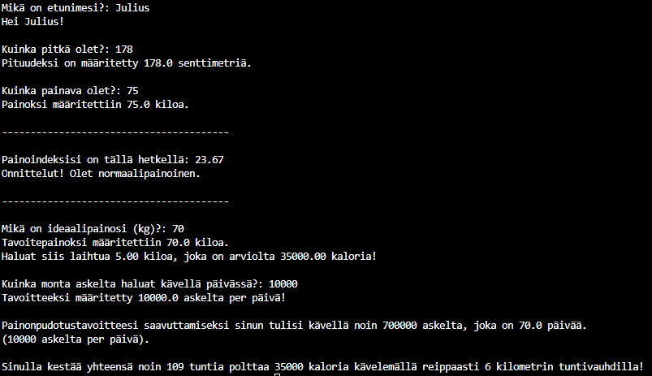

# bmi_laskuri
Python tool designed to show your current BMI and estimate calorie burn during walking exercises. By inputting your weight, height, daily step goal, this script calculates the calories burned per hour, helping you track your fitness progress and achieve your health goals.

